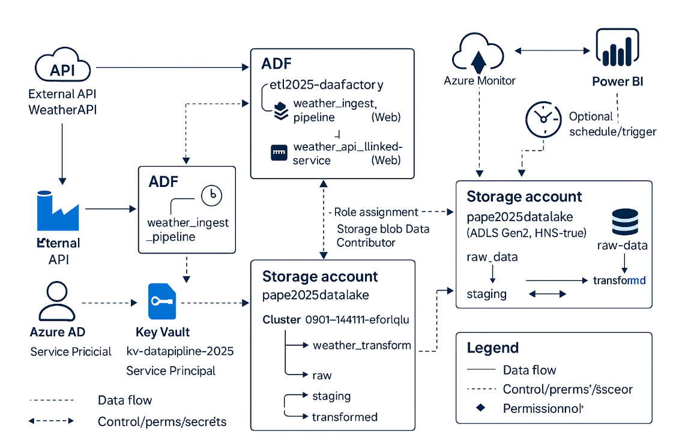

# Azure Data Pipeline — Weather API → Data Lake → Databricks → Power BI

## Contexte

Ce projet met en place une **pipeline cloud complète** sur **Azure** pour collecter, transformer et visualiser des données météo en temps réel.  
Il a été conçu comme un **cas d’usage concret de Data Engineering**, avec les briques principales d’un projet moderne :

- **Ingestion** de données depuis une API publique (Weather API / OpenWeatherMap)  
- **Stockage** brut, staging et transformé dans **Azure Data Lake Gen2**  
- **Orchestration** avec **Azure Data Factory**  
- **Transformation** des données via **Azure Databricks (PySpark/Scala)**  
- **Visualisation** finale dans **Power BI**  

L’objectif : **montrer une architecture complète de bout en bout** qu’on rencontre en entreprise (données temps réel, Big Data, BI).

---

## Architecture



1. **Weather API** → Extraction des données météo (JSON)  
2. **Azure Data Factory** → Pipeline d’ingestion (Copy Activity)  
3. **Azure Data Lake Storage Gen2**  
   - `raw/` → données brutes (JSON)  
   - `staging/` → données nettoyées  
   - `transformed/` → données enrichies prêtes pour l’analyse  
4. **Azure Databricks**  
   - Notebook PySpark pour transformer et agréger les données  
   - Nettoyage des colonnes, normalisation des dates, KPIs météo  
5. **Power BI** → Connexion au Data Lake / Databricks pour créer un **dashboard météo temps réel**

---

## Stack Technique

- **Infrastructure as Code** : Terraform  
- **Cloud Provider** : Azure  
- **Services** :
  - Azure Resource Group  
  - Azure Key Vault (gestion sécurisée des secrets : API Key, PAT Databricks)  
  - Azure Data Lake Gen2 (stockage multi-zone)  
  - Azure Data Factory (orchestration ETL)  
  - Azure Databricks (traitement Big Data)  
  - Power BI (visualisation)  
- **Langages** :  
  - HCL (Terraform)  
  - Python (Databricks Notebooks, transformation PySpark)

---

## Déploiement

### Prérequis
- Azure CLI installé et connecté :  
  ```bash
  az login


## Structure
- main.tf : ressources principales
- variables.tf : variables
- providers.tf : providers
- outputs.tf : outputs
- databricks/notebooks/weather_transform.py : notebook PySpark
